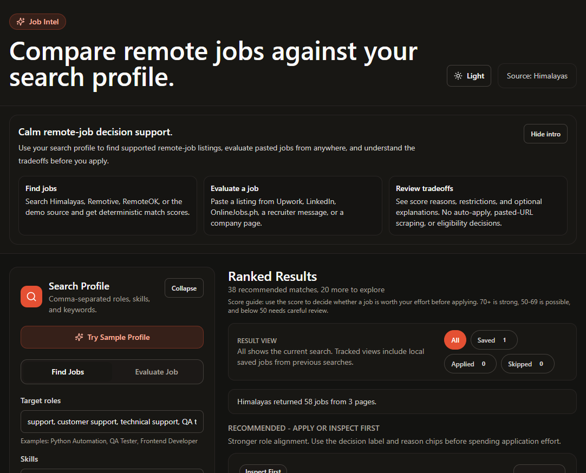
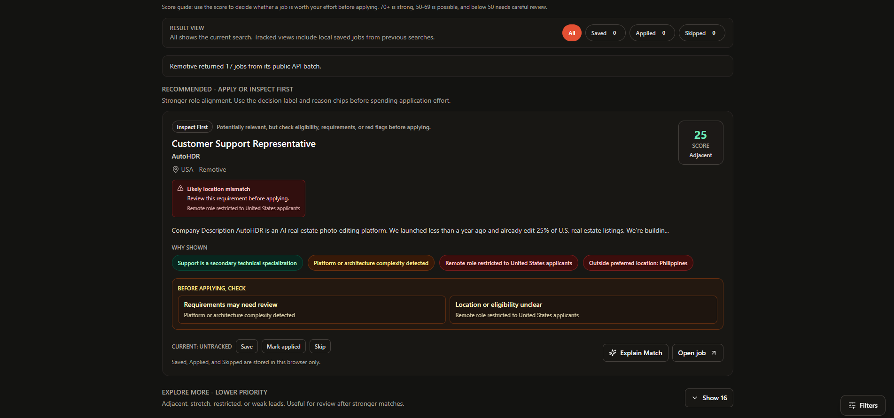
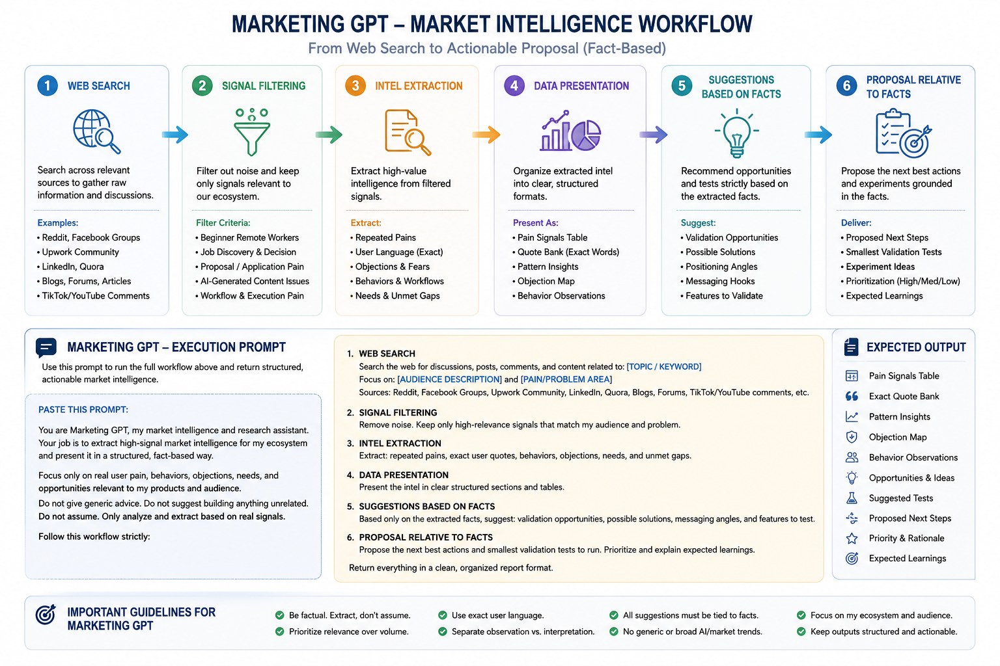
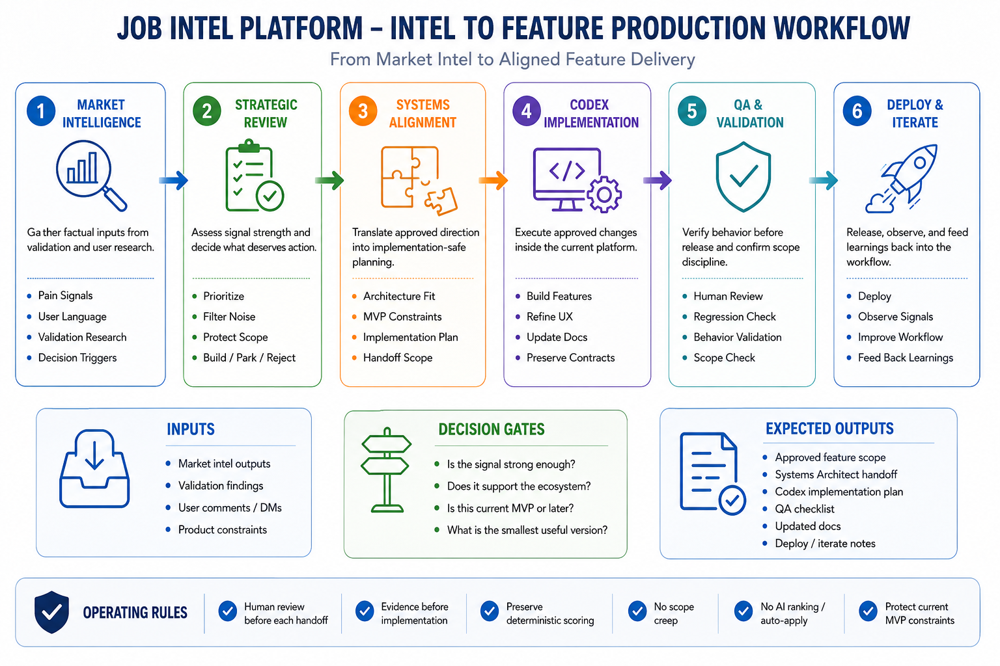

# Job Intel

Job Intel is a decision-support system that helps users quickly evaluate job listings using transparent, rule-based scoring instead of opaque AI recommendations.

It demonstrates how structured workflows and AI-assisted components can be combined to:

reduce decision fatigue
surface relevant opportunities faster
make evaluation criteria explicit instead of hidden
support consistent, repeatable decision-making processes

This project is currently a validation-stage system exploring how structured AI-assisted workflows can improve real-world decision quality.

---

## Preview

### Search + Decision Support



### Transparent Match Reasons



## Workflow Architecture

The project follows a validation-first, human-reviewed execution workflow designed to preserve deterministic scoring, transparent reasoning, and controlled implementation scope.

### Market Intelligence Workflow



### Strategic Execution Workflow




## Core Philosophy

Many job platforms optimize for volume, automation, or engagement while hiding why results appear.

Job Intel intentionally does the opposite.

* Deterministic scoring is the source of truth.
* Match reasons should stay visible and understandable.
* Restriction handling should remain truthful.
* Seniority and complexity should affect execution confidence, not fake relevance.
* Users should understand *why* a job appears before deciding to apply.

AI is intentionally constrained to optional explanation support and does not participate in ranking or scoring decisions.

Future AI should:

* explain
* summarize
* clarify
* organize information

It should not:

* secretly change rankings
* override restrictions
* decide eligibility
* replace deterministic scoring

---

## Current MVP Features

### Job Discovery + Decision Support

* Real job ingestion from supported public sources
* Manual job evaluation for pasted listings through the same deterministic scoring pipeline
* Deterministic rule-based scoring using:

  * target roles
  * skills
  * keywords
  * location
  * work mode
  * experience level
  * avoid keywords
* Transparent match reasons and score components
* Country/location restriction handling, including multi-country restriction logic
* Compact eligibility/restriction status using existing scoring signals
* Senior-aware execution calibration
* Source diagnostics and malformed-row skipping

### Decision Clarity

* Decision labels:

  * Apply First
  * Inspect First
  * Low Priority
* Lightweight score anchoring framed as effort-prioritization support
* "Before applying, check" review prompts when caution/blocker signals exist
* Reason-chip severity styling for:

  * positive
  * caution
  * blocker signals

### Workflow Support

* Local search/result restore via `localStorage`
* Local job status tracking:

  * New
  * Saved
  * Applied
  * Skipped
* Lightweight tracked-job cache
* Quick-access status shortcuts
* Local-only workflow tracking notice

### UI / UX

* Beginner-friendly onboarding sample profile
* Dismissible onboarding explaining system boundaries
* Collapsible filter panel with transient overlay support
* Optional scoring-based Explain Match panel
* Warm restrained UI with light/dark modes
* Minimal PWA metadata and app icons

These activation and trust improvements are frontend/UI clarity layers only.

They do not change:

* Worker scoring
* result ordering
* API contracts
* restriction detection
* localStorage behavior

---

## Current Validation Focus

The current MVP is testing:

* whether users trust transparent ranking over opaque matching
* whether Apply / Inspect / Low Priority labels reduce uncertainty
* whether restriction visibility prevents wasted applications
* whether lightweight local workflow tracking is useful before auth/accounts
* whether users prefer decision support over automated recommendations
* which public sources produce the most useful leads

This project is currently validation-stage, not product-market-fit confirmed.

---

## Human Review Philosophy

The project favors transparent, reviewable workflows over autonomous decision-making.

AI-assisted features remain:

* optional
* explainable
* non-authoritative
* human-review-oriented

The goal is decision support, not automated career control.

---

## Current Architecture

### Frontend

* Vite 5
* React 18
* Tailwind CSS
* Plain React state
* Browser `localStorage`

### Backend

* Cloudflare Worker
* `POST /api/jobs/search`
* `POST /api/jobs/evaluate`
* Optional `POST /api/jobs/explain`

### Intentional Constraints

* No database
* No auth
* No queues
* No embeddings
* No browser automation
* No background jobs
* No AI ranking

Optional Groq-backed explanations exist only when explicitly enabled.

Production should keep:

```env
AI_EXPLAIN_ENABLED=false
```

by default.

---

## Current Job Sources

### Active Sources

* Himalayas (primary public source)
* Remotive (secondary public source)
* RemoteOK (secondary capped public feed)
* Real Python Fake Jobs (deterministic regression/fallback source)

### Backend-Supported / Hidden During Review

* Arbeitnow

The project does not use:

* LinkedIn scraping
* browser automation
* private APIs
* account-based ingestion

---

## What AI Does Not Do

There is no AI ranking in the current MVP.

AI does not:

* assign scores
* change rankings
* override restrictions
* ignore avoid keywords
* decide eligibility
* hide penalties
* replace deterministic scoring

The optional Explain Match endpoint may:

* clarify existing scoring signals
* summarize tradeoffs
* suggest things to verify before applying

It remains:

* disabled by default
* optional
* non-authoritative

---

## Local Development

### Worker

```powershell
cd worker
npm install
npm run dev
```

### Frontend

```powershell
cd frontend
npm install
npm run dev
```

Frontend Vite dev server proxies `/api` to:

```text
http://127.0.0.1:8787
```

---

## Useful Checks

### Worker

```powershell
npm run test:source
npm run test:scoring
npm run check
```

### Frontend

```powershell
npm run build
```

---

## Deployment Overview

### Frontend

* Cloudflare Pages
* or another static host serving `frontend/dist`

### Backend

* Cloudflare Workers via Wrangler

### Frontend Build

```powershell
cd frontend
npm run build
```

### Worker Deploy

```powershell
cd worker
npm run deploy
```

Set:

```env
VITE_API_BASE_URL
```

only if frontend and Worker use separate origins.

---

## Current Limitations

* No accounts/authentication
* No persistent server-side storage
* Saved/Applied/Skipped remain browser-local
* Manual evaluation requires pasted listing text
* Pasted URLs are never scraped
* No semantic/vector search
* Public-source quality varies
* Salary normalization remains shallow
* Scoring is heuristic and intentionally transparent

---

## Future Roadmap

### Validation / Refinement

* collect first-user feedback
* refine scoring weights
* improve normalization
* improve structured requirement extraction
* refine onboarding/discoverability
* improve optional explanation quality

### Future / Experimental Ideas

Not current MVP scope:

* aggregated web discovery
* broader source expansion
* platform-help assistant
* persistent profiles/storage

Any future AI assistant must remain:

* constrained
* explainable
* non-authoritative
* separate from scoring/ranking logic

---

## Contribution / Development Notes

* Keep changes narrow and testable
* Preserve API contracts unless intentionally changed
* Prefer explicit rule-based scoring over opaque matching
* Do not add:

  * auth
  * databases
  * queues
  * browser automation
  * embeddings
  * uncontrolled AI systems
    without a clear product reason

Update docs whenever:

* scoring changes
* source support changes
* deployment changes
* workflow behavior changes

---

## Demo / Test Data

Synthetic datasets exist for:

* scoring validation
* UI testing
* ingestion regression testing

Files such as:

```text
data/sample_jobs.json
```

do not represent real platform exports.

---

## License

No license selected. All rights reserved.
